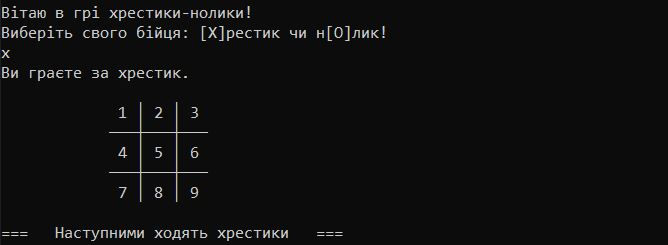
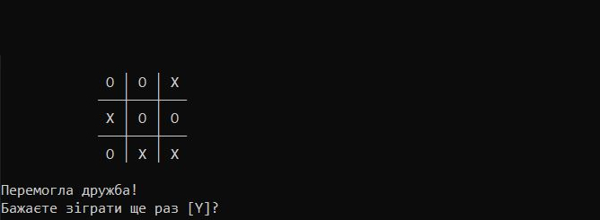

# Tic-tac toe written in Rust programming language.

## Only 🇺🇦 language is supported.

## Preview:





## Rules:
Rules of the game is very simply. You and your opponent take turns entering numbers to mark corresponding squares with your symbol ("X" or "O"). The game ends when someone draw straight line with their symbols or when no moves left.

## Download & play:

If you have AMD processor and X64 Windows version, you can play the game after downloading executable (no viruses, I promise). 
[amd-X64 build](./bin/tic-tac-toe.exe)

## Build & play:

You may clone repository and build executable in your local machine. Open terminal in the root of project and write command to build* app.
```bash
cargo build -r
```
Then you can open game by command.
```bash
#linux:

./target/release/tic-tac-toe

#or, on windows:

./target/release/tic-tac-toe.exe
```

-----
\*  -  You must have a Rust compiler.


### Have fun!
